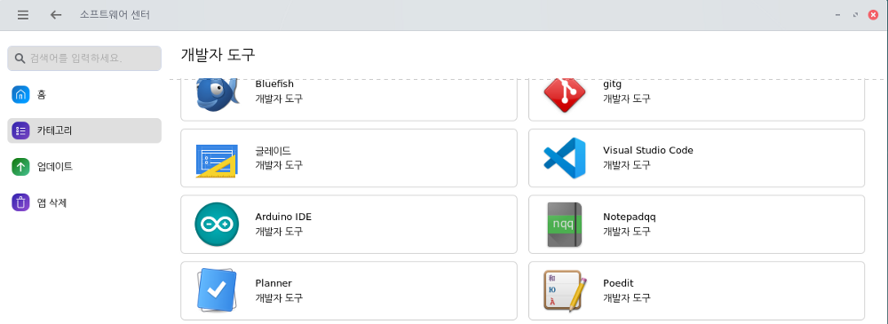
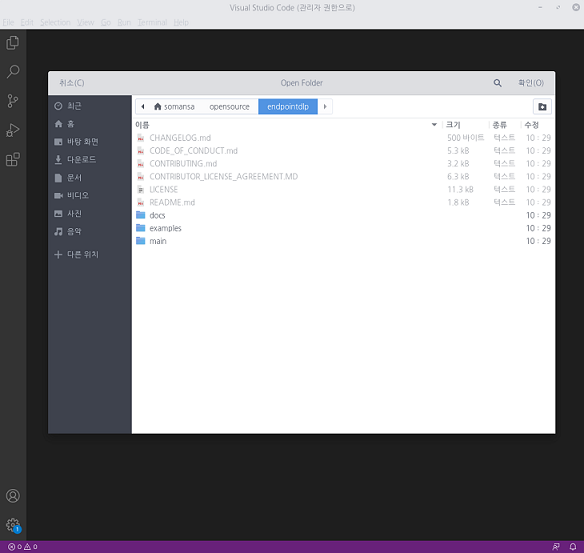

# endpointdlp

개방형OS에서의 엔드포인트 정보유출방지(Endpoint DLP) 보안 소프트웨어

## 프로젝트 소개
-------------------
본 오픈소스 프로젝트는 개방형OS 환경에서 정보유출방지 기능을 제공하기 위한 보안 소프트웨어입니다. 정보유출방지(DLP, Data Loss Prevention)는 조직내 기밀정보가 외부로 유출되는 것을 방지하는 정보보호 솔루션이며, 디바이스에 저장된 기밀정보를 검출하거나, 이동식 저장매체 또는 출력물, 네트워크 전송을 통해 유출되는 기밀정보를 탐지하여 조직의 자산을 보호할 수 있습니다.

## 프로젝트 기여하기
--------------------
프로젝트에는 다음의 방법으로 참여할 수 있습니다.
* 버그 리포트
* 수정사항 제출
* 새로운 기능 제안
* 문서
* 자세한 내용은 [Contributing Guide](https://github.com/somansa-oss/endpointdlp/blob/master/CONTRIBUTUNG.md)를 참고하시기 바랍니다.

## 프로젝트 정보
----------
* 개발 언어: C
* 개발 환경: VSCode
* 라이선스: Apache 2.0
* 문의사항: 소만사 이상진 수석연구원(sjinlee@somansa.com)
* 커뮤니케이션 채널

  -> [Slack 채널 가입 링크](https://join.slack.com/t/somansa-opensource/shared_invite/zt-ikibhul1-PT~Z9R9w5xrEA8LT_pyuDg)
    
  -> Google Groups: sjinlee@somansa.com 으로 메일 주시면 초대장을 보내드립니다. 

## Getting Started
----------
아래와 같이 git 명령을 수행하여, 소스를 내려 받습니다

> $ git clone https://github.com/somansa-oss/endpointdlp.git

소스 clone이 끝나면, 아래와 같이 endpointdlp 라는 폴더가 생성되었음을 확인할 수 있습니다.

이제 소스를 내려 받았다면, 다음 단계로 아래와 같이 개발환경을 설정할 수 있습니다.

### 개발도구 설치
---------
> * 권장 개발환경: Visual Studio Code / CMake / gdb

개방형OS에서 개발을 하기 위해서, 다양한 IDE 프로그램들이 있으나, 그 중에서 본 프로젝트에서 권장하는 것은 MS에서 만든 Visual Studio Code입니다. 
다른 IDE 도구들에 비해 다양한 장점이 있지만, 가장 마음에 드는 것은 역시 사용자(개발자)를 위한 기본 기능에 충실하다는 점입니다.
특별히, CMake를 이용하여, 개방형OS 뿐 아니라 다른 OS환경 ( Windows, MacOS) 에서 동시에 빌드 가능한 빌드 시스템 구축이 가능할 뿐 아니라, gdb와 함께 런타임 디버깅이 가능하다는 것이 무엇보다도 편리합니다.

Visual Studio Code ( 이후 Code )를 설치하는 가장 간단한 방법은 구름OS에서 제공하는 “소프트웨어 센터”에서 Code를 선택하여, 설치하는 방법입니다. 
카테고리로 개발자 도구를 선택하면, 다음과 같이 Code를 확인할 수 있습니다.

위의 Visual Studio Code를 클릭하면, 설치가 시작됩니다. 이제 다음 단계로 실제 프로젝트를 열어서, 빌드하는 과정에 대해서 살펴보겠습니다.

### 소스 빌드
---------
소스 빌드를 위해서는, 앞서 설치한 code를 실행하고, 메뉴 중에서 File > Open Folder 를 클릭하여 폴더를 열면 됩니다. 

본 프로젝트에서는 아래와 같이 PIKern 및 PISupervisor의 2개 하위 모듈로 구성됩니다. 각 모듈을 빌드하기 위해서는, 각 모듈에 해당하는 폴더를 open하면 됩니다.

| 모듈 이름 | 폴더 위치 | 비고 | 
| :------------ | :-----------: | -------------------: | 
| PIKern | endpointdlp/main/PIKern | 커널 통제 모듈 |
| PISupervisor | endpointdlp/main | 커널 통제 인터페이스 모듈 |

